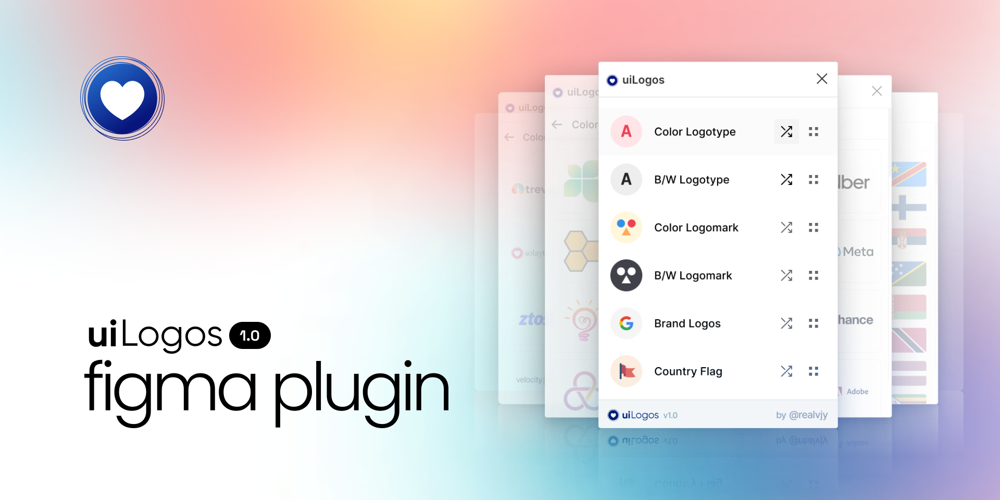

[](https://www.figma.com/community/plugin/1120667703468196103)

# uiLogos Figma plugin

Every now and then, we all need a logo as a placeholder for design and don't have the time to create a dummy logo or Google one. UILogos allows you to quickly insert dummy logos or Brand logos into your design.

I have also included all country flags (194) and selected brand logos. With this plugin, you can quickly insert these logos into Figma or Figjam files. The plugin offers a variety of options.

## Figma Community

Grab community file from 👉 here [Figma Community](https://www.figma.com/community/plugin/1120667703468196103)

## Local development

Plugin is opensource. You are welcome to contribute.

1. Clone the repository

   ```shell
   git clone
   cd uilogs-figma
   ```

1. Install the dependencies

   ```shell
   yarn
   ```

1. Build the plugin

   ```
   yarn watch
   ```

1. Open the [Figma desktop app](https://www.figma.com/downloads/)

1. Go to `Menu > Plugins > Development > Import Plugin from manifest...`

1. Choose `uilogos-plugin/manifest.json`

1. Run the plugin by going to `Menu > Plugins > Development > 3dicons`

## How to use

Soon here

## Support & Donate

The goal of this project is to contribute to the open design community. Even though I do not intend to charge for these community resources, if uiLogos has ever been useful to you or your team, I would appreciate your support! It helps to maintain server costs and keep it grow. More details about the project [uilogos.co/figma](https://uilogos.co)

[Github sponsor](https://github.com/sponsors/realvjy) | [Buy me a coffee](https://buymeacoffee.com/realvjy)

## Say hi or Feedback

Feel free to tag me or say hi on Twitter ([@realvjy](http://twitter.com/realvjy)). You are also welcome to share your feedback or bug reports 🙏

Website: [uilogos.co](https://uilogos.co)
